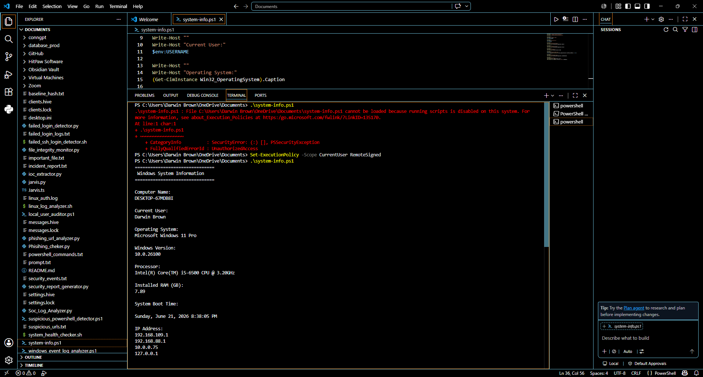
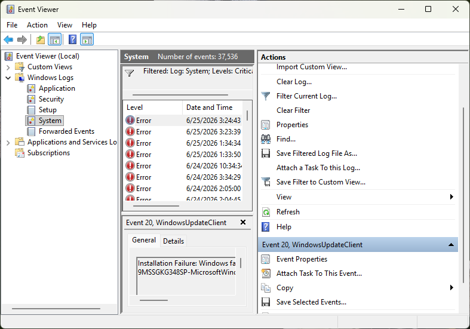
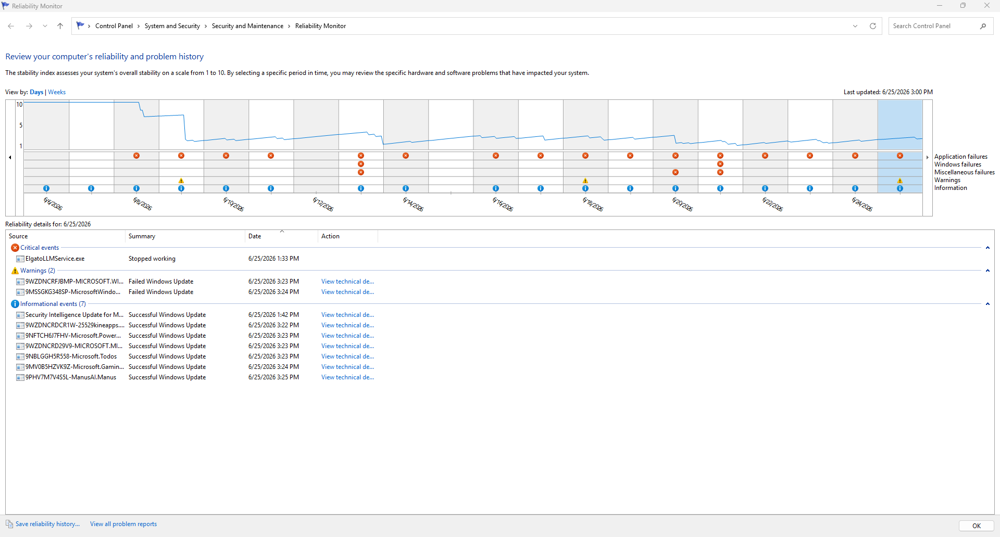
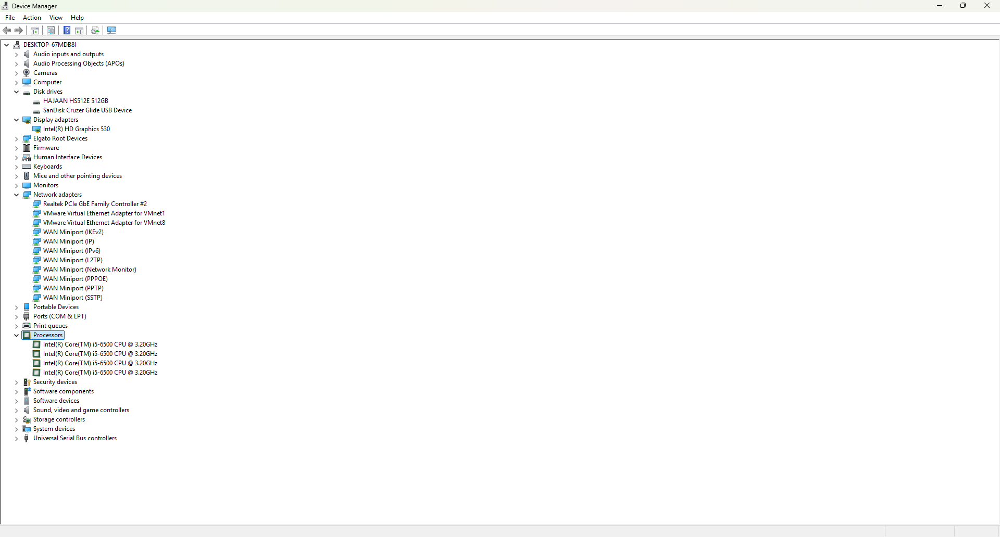
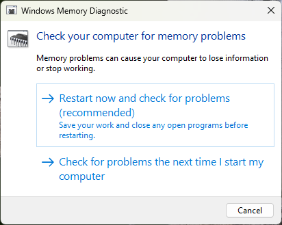
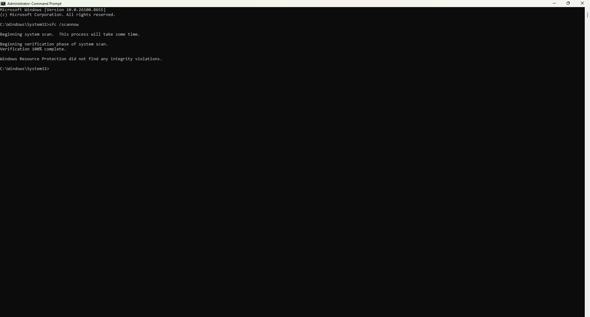
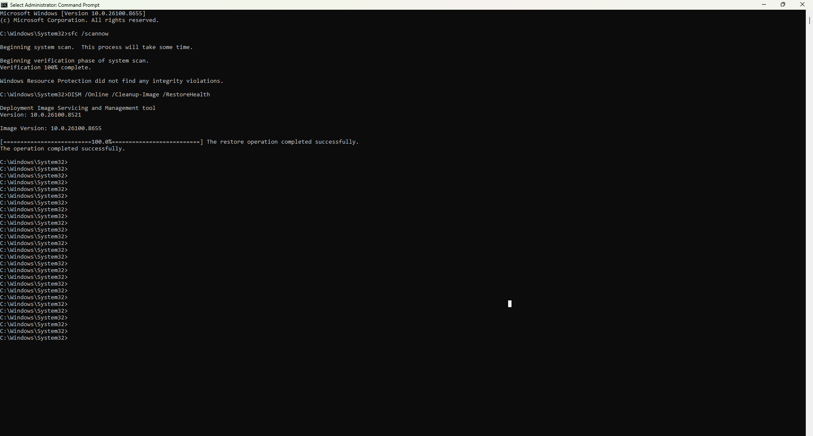
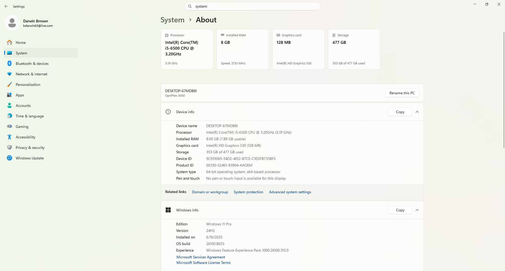

# Darwin BSOD Troubleshooting Lab

## Overview

This project demonstrates a hands-on Windows 11 Blue Screen of Death (BSOD) troubleshooting process using built-in Microsoft diagnostic and repair tools. The lab follows a structured Help Desk workflow to identify system errors, verify hardware health, repair Windows system files, and confirm overall operating system stability.

---

## Skills Demonstrated

- Windows 11 Administration
- BSOD Troubleshooting
- Event Viewer Analysis
- Reliability Monitor
- Device Manager
- Windows Memory Diagnostic
- System File Checker (SFC)
- DISM Image Repair
- Windows System Diagnostics
- Help Desk Troubleshooting
- Technical Documentation

---

## Tools Used

- Windows 11 Pro
- Command Prompt (Administrator)
- Event Viewer
- Reliability Monitor
- Device Manager
- Windows Memory Diagnostic
- System File Checker (SFC)
- DISM
- Windows Settings

---

# Lab Walkthrough

## Screenshot 1 — System Information

Collected Windows operating system and hardware information using the **systeminfo** command to establish a system baseline before beginning troubleshooting.



---

## Screenshot 2 — Event Viewer

Reviewed Windows System logs in Event Viewer to identify critical events and system errors related to operating system stability.



---

## Screenshot 3 — Reliability Monitor

Analyzed Windows Reliability Monitor to review application failures, Windows failures, warning events, and overall system reliability history.



---

## Screenshot 4 — Device Manager

Verified installed hardware devices and confirmed there were no missing drivers or hardware warning indicators.



---

## Screenshot 5 — Windows Memory Diagnostic

Opened Windows Memory Diagnostic to verify available memory testing options commonly used when investigating BSOD issues caused by faulty RAM.



---

## Screenshot 6 — System File Checker

Executed System File Checker to scan Windows protected system files and verify file integrity.

```cmd
sfc /scannow
```

The scan completed successfully without detecting integrity violations.



---

## Screenshot 7 — DISM RestoreHealth

Executed the DISM RestoreHealth command to repair the Windows component store and validate the Windows image.

```cmd
DISM /Online /Cleanup-Image /RestoreHealth
```

The repair completed successfully.



---

## Screenshot 8 — Project Complete

Verified final Windows system information, hardware specifications, installed memory, Windows edition, and operating system build after completing the troubleshooting process.



---

# Troubleshooting Process

1. Gather system information.
2. Review Event Viewer logs.
3. Analyze Reliability Monitor history.
4. Verify hardware using Device Manager.
5. Review memory diagnostic options.
6. Scan Windows system files using SFC.
7. Repair the Windows image using DISM.
8. Verify overall system health.

---

# Commands Used

```cmd
systeminfo

sfc /scannow

DISM /Online /Cleanup-Image /RestoreHealth
```

---

# Project Outcome

- Verified Windows operating system information.
- Reviewed system error logs.
- Examined system reliability history.
- Verified hardware status.
- Performed memory diagnostic preparation.
- Verified Windows system file integrity.
- Repaired the Windows component store using DISM.
- Confirmed successful Windows system health after troubleshooting.

---

## Repository Structure

```
.
├── screenshots
└──README.md 
    ├── 01-system-information.png
    ├── 02-event-viewer-error.png
    ├── 03-reliability-monitor-png
    ├── 04-device-manager.png
    ├── 05-windows-memory-diagnostic.png
    ├── 06-sfs-scannow.png
    ├── 07-dism-restorehealth.png
    └── 08-project-done.png
```

---

## Resume Highlights

- Performed Windows 11 BSOD troubleshooting using Microsoft diagnostic tools.
- Investigated system failures with Event Viewer and Reliability Monitor.
- Verified hardware health through Device Manager.
- Executed SFC and DISM to diagnose and repair Windows operating system files.
- Documented a complete Help Desk troubleshooting workflow using industry-standard Windows utilities.
